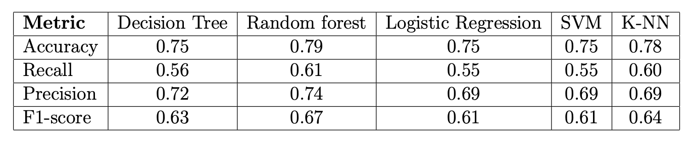
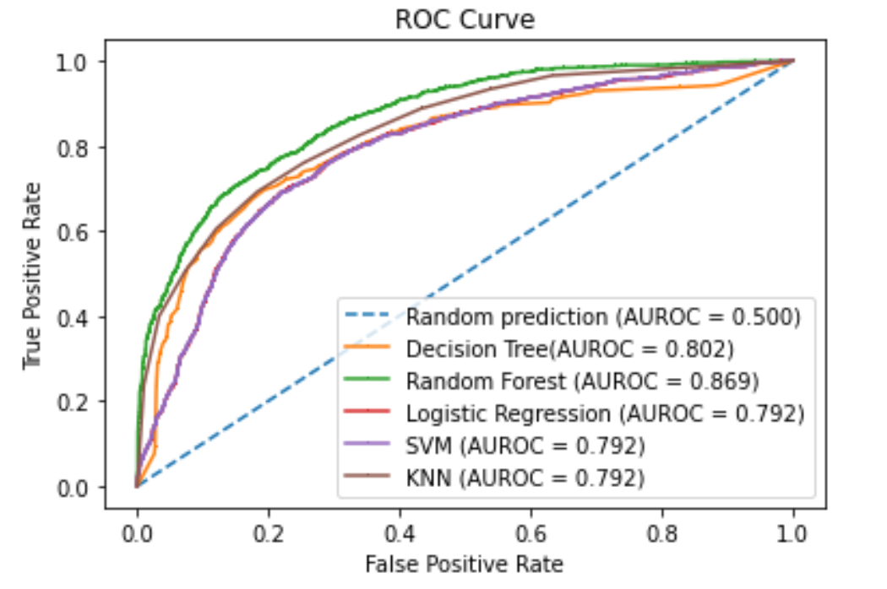

# Calssification-Magic-gamma-telescope-data-set
This project is a thesis completed during the course: Mathematics in machine learning. Please refer to the [report](/signal_vs_noise_classification.pdf) for detailed information. In this project we performed data analysis and applied machine learning including various classification techniques.   
## Data Set
The data set used can be downloaded from the following UCI repository:   
[https://archive.ics.uci.edu/ml/datasets/magic+gamma+telescope](https://archive.ics.uci.edu/ml/datasets/magic+gamma+telescope)

## Evaluation
The result of applying various classifiers is as follows:
   
The performance of these classifiers on the given data set can also be shown using the following ROC-curve:

